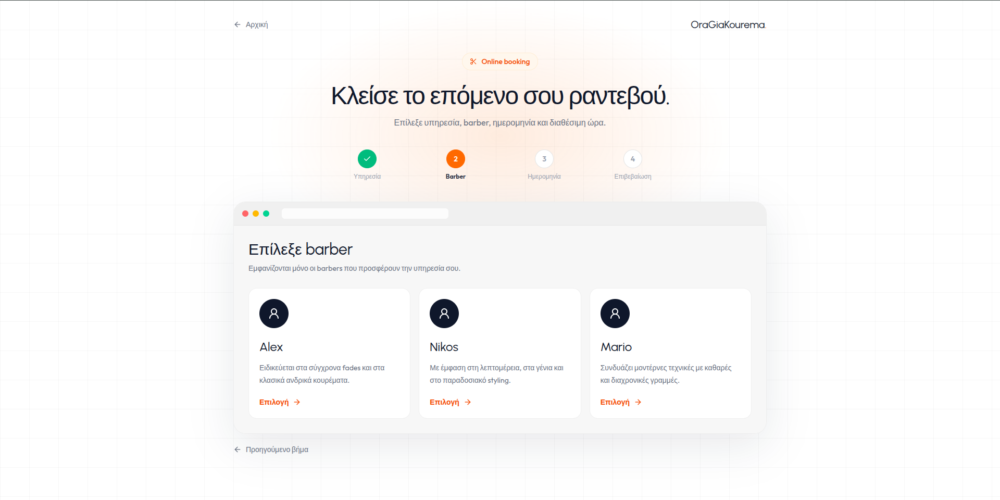
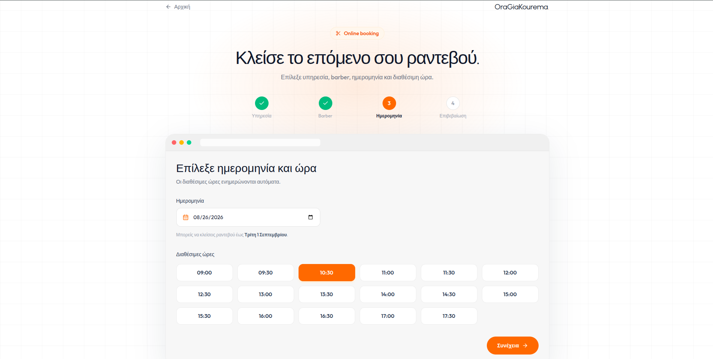
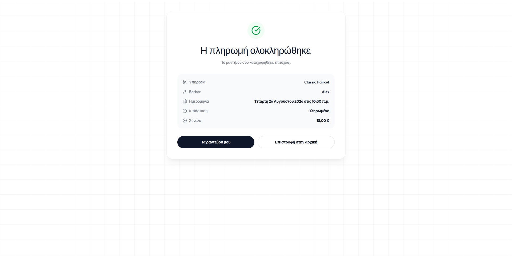
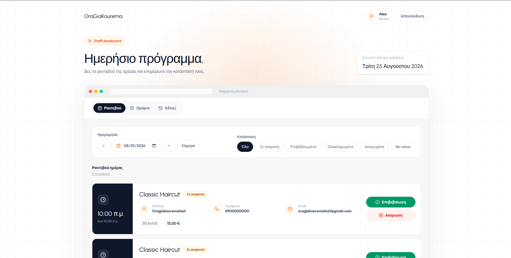
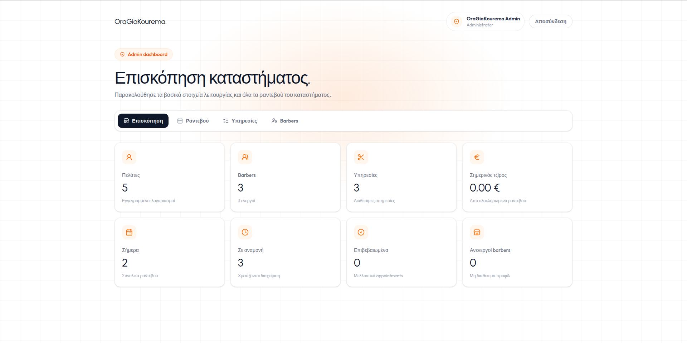

# OraGiaKourema


OraGiaKourema is a full-stack barbershop booking application built as a portfolio project. It includes customer authentication, appointment scheduling, staff/admin workflows, Stripe Checkout payments, transactional email infrastructure, automated tests, CI, and a live deployment.

## Live Demo

Live app: https://ora-gia-kourema.onrender.com

> The live demo is hosted on a free Render web service, so the first request after inactivity may take a short moment to wake up.

## Project Status

The main customer booking flow is deployed and working:

- Email/password registration and login
- Secure HTTP-only cookie authentication
- Appointment booking
- Barber and service selection
- Availability handling
- Stripe Checkout in test mode
- Stripe webhook handling
- PostgreSQL database hosted on Neon
- GitHub Actions CI

Google OAuth is implemented in the codebase, but final public Google Console configuration is still pending.

This is a portfolio demo, not a production SaaS product. Public users can test the customer booking flow; staff/admin credentials are intentionally not published.

## Screenshots

### Homepage


### Mobile Homepage


### Booking Flow





### Stripe Payment Success



### Staff Dashboard



### Admin Dashboard



## Tech Stack

### Frontend

- React
- TypeScript
- Vite
- Tailwind CSS
- TanStack Query
- React Router

### Backend

- Node.js
- Express
- TypeScript
- Prisma
- PostgreSQL
- Zod
- JWT access/refresh tokens
- HTTP-only cookies
- Argon2 password hashing
- Stripe
- Resend
- Google Auth Library

### Infrastructure

- Render Web Service
- Neon PostgreSQL
- GitHub Actions CI
- Docker PostgreSQL test database

## Features

### Customer Features

- Register and log in with email/password
- Browse available services
- Select barber, date, and time slot
- Book appointments
- Pay at the store or through Stripe Checkout
- View booking/payment result pages

### Authentication

- Access and refresh token flow
- HTTP-only cookies
- Refresh-token rotation
- Session persistence
- Logout support
- Role-based access control
- Google OAuth implementation with account linking support

### Appointment System

- Barber-service relationships
- Working hours
- Time-off support
- Appointment overlap protection
- Appointment status management
- Payment method tracking
- Payment status tracking

### Staff/Admin Features

- Staff appointment management
- Appointment status updates
- Admin-level management routes
- Role-based route protection

### Payments

- Stripe Checkout integration
- Test-mode payments
- Webhook signature verification
- Handled webhook events:
  - `checkout.session.completed`
  - `checkout.session.expired`

### Email

Transactional email integration is implemented through an email provider abstraction.

In the live portfolio deployment, email sending is currently disabled with:

```env
EMAIL_ENABLED=false
```

## How It Works

Customer booking flow:

1. The user registers or logs in.
2. The user selects a service.
3. The user selects a barber.
4. The user selects a date and available time slot.
5. The API calculates availability from working hours, time off, service duration, and existing appointments.
6. The appointment is created.
7. The user can pay at the store or through Stripe Checkout in test mode.
8. Stripe webhooks update payment and appointment state after checkout events.

## Architecture

The portfolio deployment uses a same-origin setup:

```text
https://ora-gia-kourema.onrender.com
├── /                      React frontend
├── /login                 React route
├── /booking               React route
├── /booking/payment-*     React routes
├── /api/auth/*            Express API
├── /api/appointments/*    Express API
├── /api/stripe/webhook    Stripe webhook
└── /api/health            Health check
```

The Express server serves both:

1. the API under `/api`
2. the built React frontend from `apps/web/dist`

React Router direct URLs are handled through a production SPA fallback, while `/api` routes remain handled by Express.

This same-origin setup keeps authentication cookies simple and avoids cross-site cookie issues between separate frontend and backend domains.

## Database and Seeding

Prisma models the core booking domain: users, sessions, barbers, services, working hours, time off, appointments, and payment state.

The seed script creates demo services, barbers, working hours, and sample data. Optional barber/admin seed accounts can be created by setting:

- `SEED_BARBER_PASSWORD`
- `SEED_ADMIN_PASSWORD`

Those values are intentionally not committed or published.

## Monorepo Structure

```text
.
├── apps
│   ├── api
│   │   ├── prisma
│   │   ├── src
│   │   └── test
│   └── web
│       ├── src
│       └── test
├── docs
│   └── screenshots
├── docker-compose.yml
├── docker-compose.test.yml
├── package.json
└── package-lock.json
```

## Local Development

### 1. Install dependencies

```bash
npm install
```

### 2. Start the local PostgreSQL database

```bash
npm run db:up
```

### 3. Configure environment variables

Create local environment files from the example files and fill in the required values.

For the API:

```text
apps/api/.env
```

For the frontend:

```text
apps/web/.env
```

Do not commit real `.env` files.

### 4. Run Prisma migrations

```bash
npm run prisma:migrate --workspace=apps/api
```

### 5. Seed local data

```bash
npm run prisma:seed --workspace=apps/api
```

### 6. Start the API

```bash
npm run dev --workspace=apps/api
```

### 7. Start the frontend

```bash
npm run dev --workspace=apps/web
```

By default:

```text
Frontend: http://localhost:5173
API:      http://localhost:4000
```

## Testing

The project includes automated API integration tests and frontend tests.

### Start the test database

```bash
npm run test:db:up
```

### Run test database migrations

```bash
npm run test:db:migrate
```

### API checks

```bash
npm run typecheck --workspace=apps/api
npm run typecheck:test --workspace=apps/api
npm run test:integration --workspace=apps/api
npm run build --workspace=apps/api
```

### Frontend checks

```bash
npm run test --workspace=apps/web
npm run typecheck:test --workspace=apps/web
npm run lint --workspace=apps/web
npm run build --workspace=apps/web
```

### Stop the test database

```bash
npm run test:db:down
```

## CI

GitHub Actions runs on pull requests and pushes to `main`.

The CI workflow verifies:

- API typecheck
- API test typecheck
- API integration tests
- Frontend tests
- Frontend test typecheck
- Frontend lint
- Frontend production build
- API production build with Prisma client generation

The CI uses a Docker PostgreSQL test database and placeholder environment variables. It does not use production secrets or connect to external production services.

## Deployment

The portfolio deployment uses:

- Render Web Service for the Express API and React frontend
- Neon PostgreSQL for the database
- Stripe test mode for payments
- GitHub Actions for CI

The production build flow is:

```text
npm ci --include=dev
npm run build --workspace=apps/web
npm run build --workspace=apps/api
npm run start --workspace=apps/api
```

The API start command runs:

```bash
node dist/server.js
```

## Important Environment Variables

### API

```env
NODE_ENV=production
PORT=10000
FRONTEND_URL=https://ora-gia-kourema.onrender.com
CORS_ALLOWED_ORIGINS=https://ora-gia-kourema.onrender.com
TRUST_PROXY=1

DATABASE_URL=
DIRECT_URL=

JWT_ACCESS_SECRET=
JWT_REFRESH_SECRET=

GOOGLE_CLIENT_ID=

STRIPE_SECRET_KEY=
STRIPE_WEBHOOK_SECRET=
STRIPE_CURRENCY=eur
STRIPE_CHECKOUT_EXPIRES_MINUTES=30

EMAIL_ENABLED=false
EMAIL_PROVIDER=console
EMAIL_FROM_NAME=OraGiaKourema
EMAIL_FROM_ADDRESS=appointments@example.com

SEED_BARBER_PASSWORD=
SEED_ADMIN_PASSWORD=
```

### Frontend

```env
VITE_API_URL=/api
VITE_GOOGLE_CLIENT_ID=
```

## Security Notes

- Passwords are hashed with Argon2.
- Authentication uses HTTP-only cookies.
- Refresh tokens are stored server-side as hashes.
- Refresh-token rotation is implemented.
- Protected routes use role-based access control.
- Stripe webhooks are verified with a signing secret.
- Production cookies use `Secure` and `SameSite=Lax` in the same-origin deployment.
- Real secrets are not committed to the repository.
- Staff/admin credentials are not published publicly.

## Known Limitations

- Google OAuth is implemented, but final public Google Console configuration is still pending.
- Email sending is disabled in the live portfolio deployment.
- The live demo runs on free-tier infrastructure, so cold starts may occur after inactivity.
- Staff/admin demo credentials are intentionally not published.
- Stripe is configured for test-mode demonstration, not live payments.

## Author

Built by Malvin Hoxha as a full-stack portfolio project.